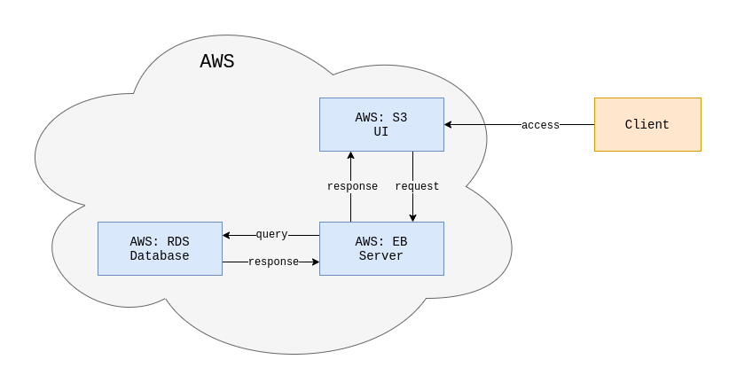

# Infrastructure

The project is hosted on Amazon Web Services (AWS) using the following services:
- Elastic Beanstalk (EB): Express backend running on Node.js used to provide an API
- Relational Database (RDS): Postgres database for persisting data
- Simple Storage (S3): Hosting Angular frontend and image storage

