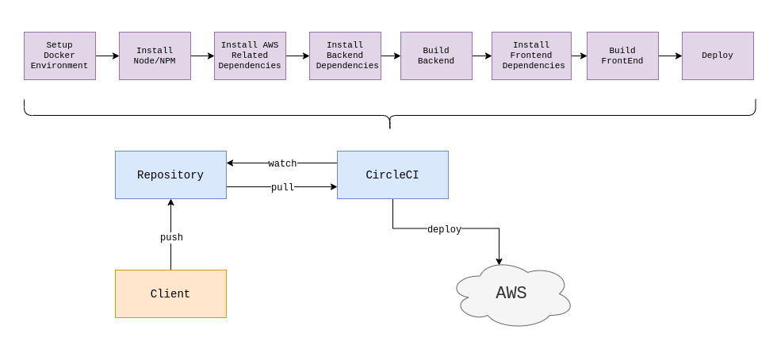

# Pipeline

## Pipeline Description
- Code changes are pushed to repository
- CircleCI detects changes to repository and begins build and deploy process
- A docker environment is created in which this process takes place
- Node and NPM are installed
- The code is pulled from the repository
- Amazon Web Services orbs are installed and setup to faciliate deployment
- Node modules are installed for the backend
- The backend is built
- Node modules are installed for the frontend
- The frontend is built
- The backend is deployed to the Elastic Beanstalk Environment (EB)
- The frontend is deployed to the Simple Storage Service (S3)